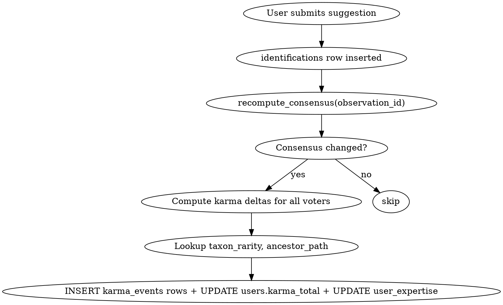

# Karma, Expertise per taxon, and Rarity-weighted rewards

**Date:** 2026-04-27
**Status:** Design — pending user review
**Owner:** Artemio Padilla
**Supersedes (partially):** the v1.2 line in `docs/specs/modules/22-community-validation.md` ("weighted votes by reputation score (cumulative validation history)") — this spec is the concrete realization of that future-work item.
**Related modules:** 22 (community validation), 04 (auth/users), 13 (identifier registry), badges + streaks (existing).

---

## Goals

1. Replace the binary `users.is_expert` flag with a **continuous, per-taxon expertise score** computed from validated history, hybridized with the existing `expert_applications` flow for "verified" credentials.
2. Add a **global karma score** that aggregates user activity (observe, suggest, validate, comment) and gates platform privileges over time.
3. Make **harder/rarer identifications worth more karma** than identifying common species, so the score signals contribution-value rather than mere activity volume.
4. Build a **welcoming, engaging UX**: penalties only when a deeper-expertise voter overrides you (asymmetric magnitudes), grace period for new users, silent losses + visible wins, predictability before each vote.
5. Layer engagement loops (streak multipliers, leaderboards, "first in Rastrum" badges, Pokédex view, discovery moments for rare/threatened species) on top of the karma core.

## Non-goals

- A general moderation/admin dashboard. The spec uses `expert_applications` and admin review (already in module 22) but does not redesign moderation.
- Realtime karma updates. Karma changes are eventually-consistent (visible on next page load and via the weekly digest).
- Cross-platform reputation portability (iNaturalist sync, eBird, etc.). Karma is Rastrum-local for v1; portability is out of scope.
- Monetary rewards or tokenization. Karma is a social signal only.

---

## Decisions captured (brainstorming outcome)

| Axis | Decision | Rationale |
|---|---|---|
| Karma shape | **Global + per-taxon** (option C) | Both privileges-gating and vote-weighting need different signals |
| Expertise granularity | **Any rank, most-specific-ancestor wins** (option A) | Future-proof, no schema migration when Quercus subgenus experts emerge |
| Earning expertise | **Hybrid: organic accrual + verified floor/multiplier** (option C) | Solves bootstrap problem without requiring active admin |
| False-vote penalty | **B + E2 + E3**: only when a more-specific expert wins consensus, asymmetric +5/−2, 30-day or 20-vote grace for new users | Best UX/justice balance for a small community |
| Rarity weighting | **Percentile buckets (B), augmented by IUCN/NOM bonuses (C) when data exists** | Implementable today, communicable to user |
| Notifications | **Asymmetric: visible wins, silent losses, weekly digest** | Eliminates shame loops; preserves transparency |
| Predictability | **Magnitudes shown in suggest modal pre-vote** | Zero surprises is the cornerstone of fairness |

---

## Data model

All changes are additive to the existing schema. No table is dropped or renamed; `is_expert` is kept for backwards compatibility but becomes a derived view of `user_expertise`.

### New: `user_expertise`

```sql
CREATE TABLE public.user_expertise (
  user_id      uuid    NOT NULL REFERENCES public.users(id) ON DELETE CASCADE,
  taxon_id     uuid    NOT NULL REFERENCES public.taxa(id)  ON DELETE CASCADE,
  score        numeric NOT NULL DEFAULT 0,        -- organic accrual
  verified_at  timestamptz,                       -- non-null if approved via expert_applications
  verified_by  uuid    REFERENCES public.users(id),
  updated_at   timestamptz NOT NULL DEFAULT now(),
  PRIMARY KEY (user_id, taxon_id)
);
CREATE INDEX idx_user_expertise_taxon  ON user_expertise(taxon_id);
CREATE INDEX idx_user_expertise_score  ON user_expertise(user_id, score DESC);
```

`score` accumulates from validated identifications. `verified_at IS NOT NULL` means an `expert_applications` row was approved for this `(user_id, taxon_id)` pair, granting a floor minimum of 50 points and a 1.5× multiplier on subsequent gains in this taxon (configurable via `karma_config`).

### New: `taxa.ancestor_path` (column addition)

```sql
ALTER TABLE public.taxa
  ADD COLUMN IF NOT EXISTS ancestor_path uuid[] NOT NULL DEFAULT '{}';
CREATE INDEX IF NOT EXISTS idx_taxa_ancestor_path
  ON taxa USING GIN (ancestor_path);
```

Populated by a trigger on `INSERT/UPDATE` of `taxa.parent_id`. The path is the chain of ancestor IDs from immediate parent up to root, ordered most-specific-first. Lookup of "most-specific ancestor of taxon T that the user has expertise in" becomes one indexed array overlap:

```sql
SELECT taxon_id
FROM   user_expertise ue
WHERE  ue.user_id = $1
  AND  ue.taxon_id = ANY($2::uuid[])  -- ancestor_path of the observation taxon
ORDER BY array_position($2, ue.taxon_id)  -- most-specific = earliest in path
LIMIT  1;
```

This replaces the current kingdom-only `expert_taxa = ANY(...)` pattern with a generalized rank-aware lookup.

### New: `taxon_rarity` (materialized table, refreshed nightly)

```sql
CREATE TABLE public.taxon_rarity (
  taxon_id    uuid PRIMARY KEY REFERENCES public.taxa(id) ON DELETE CASCADE,
  obs_count   integer NOT NULL,
  percentile  numeric NOT NULL,                  -- 0..100
  bucket      smallint NOT NULL,                 -- 1=floor, 5=ultra-rare
  multiplier  numeric NOT NULL,                  -- karma multiplier
  refreshed_at timestamptz NOT NULL DEFAULT now()
);
```

Refreshed by a `pg_cron` job at 03:00 UTC daily. Bucket boundaries:

| Bucket | Frequency | Multiplier | Examples |
|---|---|---|---|
| 1 | top 10% most common | 1.0× | Felis catus, Canis familiaris, Columba livia |
| 2 | percentile 50–90 | 1.5× | local commons |
| 3 | percentile 10–50 | 2.5× | mid-frequency natives |
| 4 | top 10% rarest | 4.0× | regional rarities |
| 5 | < 5 obs in DB total | 5.0× | first records / discoveries |

When `taxa.iucn_status` and/or `taxa.nom_059_status` columns exist (deferred — they don't yet), additional fixed bonuses apply:

| Status | Bonus |
|---|---|
| IUCN Vulnerable | +1.0× |
| IUCN Endangered/Critically Endangered | +1.5× |
| NOM-059 amenazada | +1.5× |
| CITES Apéndice I | +2.0× |
| Endemic to Mexico | +1.0× |

Bonuses are added (not multiplied) to the bucket multiplier.

### New: `karma_events` (append-only ledger)

```sql
CREATE TABLE public.karma_events (
  id              bigserial PRIMARY KEY,
  user_id         uuid NOT NULL REFERENCES public.users(id) ON DELETE CASCADE,
  observation_id  uuid REFERENCES public.observations(id) ON DELETE SET NULL,
  taxon_id        uuid REFERENCES public.taxa(id) ON DELETE SET NULL,
  delta           numeric NOT NULL,
  reason          text NOT NULL,                 -- 'consensus_win', 'consensus_loss', 'first_record', 'observation_synced', 'comment'
  rarity_bucket   smallint,
  expertise_rank  integer,                       -- depth in ancestor_path of matched expertise (NULL if none)
  created_at      timestamptz NOT NULL DEFAULT now()
);
CREATE INDEX idx_karma_events_user ON karma_events(user_id, created_at DESC);
```

The ledger is append-only. Total karma is a sum, cached for read performance:

### Extension: `users` columns

```sql
ALTER TABLE public.users
  ADD COLUMN IF NOT EXISTS karma_total      numeric NOT NULL DEFAULT 0,
  ADD COLUMN IF NOT EXISTS karma_updated_at timestamptz NOT NULL DEFAULT now(),
  ADD COLUMN IF NOT EXISTS grace_until      timestamptz;  -- null after grace expires
```

`karma_total` is updated atomically inside each `karma_events` insert via trigger. `grace_until` is set on user creation to `created_at + INTERVAL '30 days'` and additionally requires `vote_count < 20` to be active (whichever expires first).

---

## Reward formulas

```
rarity_multiplier := COALESCE(taxon_rarity.multiplier, 1.0)
                   + iucn_bonus
                   + nom_bonus
                   + endemic_bonus

streak_multiplier := CASE
  WHEN current_streak >= 30 THEN 1.5
  WHEN current_streak >=  7 THEN 1.2
  ELSE 1.0
END

expertise_multiplier := CASE
  WHEN user has verified_at IS NOT NULL on the matched ancestor THEN 1.5
  ELSE 1.0
END

confidence_factor := { 0.5 → 0.4 ; 0.7 → 0.7 ; 0.9 → 1.0 }
```

### Win (consensus matches the user's vote)

```
delta = +5 × rarity_multiplier × streak_multiplier × expertise_multiplier × confidence_factor
```

This delta is also added to `user_expertise.score` for the matched-ancestor taxon (most-specific). If no expertise match exists, a new `user_expertise` row is created at the *kingdom level* of the observation taxon — the user is starting to specialize there.

### Loss (a deeper-expertise voter wins consensus over the user's vote)

```
penalty_rarity := LEAST(rarity_multiplier, 2.0)   -- cap at 2× to avoid devastating losses

delta = −2 × penalty_rarity × confidence_factor
```

Note: penalties **never** scale by streak or expertise. The user's streak doesn't worsen the hit, and being an expert doesn't make the hit worse. Asymmetric.

### Grace period override

If `now() < grace_until` AND the user's lifetime `vote_count < 20`, **all penalty deltas are zeroed out**. Wins still count normally. The UI surfaces this state (see UI section).

### Bonus events

| Event | Delta |
|---|---|
| First sync of an observation in Rastrum (any species) | +5 |
| First record in Rastrum of a species (anyone) | +25 + "First in Rastrum" badge |
| Comment posted that gets ≥3 reactions | +2 (capped at 3 per day) |
| Streak day increment (in addition to wins) | already handled by `user_streaks`, no new delta |

---

## Computation flow



**Where it runs:** entirely inside the existing `recompute_consensus(observation_id)` Postgres function. We extend that function with a final step that, when consensus state actually changed, iterates over all `validated_by` rows for the observation and calls a new helper `award_karma(user_id, observation_id, outcome)`. The helper does the rarity lookup, ancestor lookup, and INSERT.

**No new Edge Functions** in v1 of karma — everything is in-database, atomic with the consensus computation. Edge Function involvement only for: (a) the weekly digest email (`weekly-karma-digest`, runs Sunday 18:00 via `pg_cron` triggering an HTTP call), (b) optional analytics emit.

---

## UI surfaces

### Suggest modal — predictability microcopy

Below the Submit button, dynamically render:

> *"Esta especie tiene rareza ★★★★ (Vulnerable IUCN) — tu voto pesa **1.0×** en Plantae · acertar: **+20** / fallar: **−4**"*

Or for a user in grace:

> *"🎓 Estás en periodo de aprendizaje (24 días restantes) — votar no resta karma."*

The microcopy is computed client-side using the rarity_bucket, the user's expertise lookup, and the user's grace status — all available in the suggestion modal's hydration query.

### Profile — karma + per-taxon expertise

New profile section between streak and badges:

- Big number: `karma_total` with a thin progress bar to the next gating threshold (e.g., 100 → can verify reports, 500 → can flag false votes).
- Top-5 taxa where the user has expertise, formatted: `🌿 Quercus · 47 pts (rank 8 in MX)`. Click → drills into a per-taxon page showing the user's history in that taxon.
- Subtle delta indicator week-over-week: `+24 esta semana`.
- Verified badge (small ✓) next to taxa where `verified_at IS NOT NULL`.

### Profile — Pokédex view

New page `/profile/dex/` (and `/perfil/dex/`). Renders a grid of all species the user has observed or correctly identified, grouped by family. Each tile shows a thumbnail, scientific name, rarity tier, count, and date of first encounter. Empty slots in popular families are visible as outlined placeholders, inviting completion. Read entirely from existing `observations` + `identifications` joined with `taxa` and `taxon_rarity`.

### Notifications

- **Wins:** toast at the moment of consensus event with confetti animation, pinned for 4s. Body: `+12 karma — primera ID en Rastrum de *Quercus brandegei* 🌟`.
- **Losses:** silent. The number changes on the profile but no toast, no email, no DOM event.
- **Weekly digest** (opt-in via `streak_digest_opt_in`, reusing existing column): Sunday 18:00, email body: `Esta semana: +47 karma · 3 nuevas especies en tu Pokédex · racha de 14 días viva`.
- **Discovery moments:** when a user observes/IDs a species in bucket 5 OR with IUCN ≥ Vulnerable, an interstitial appears: `¡Increíble! *Pseudoeurycea bellii* es endémica de México y está en peligro. Acabas de aportar un dato valioso para su conservación.` Dismissable, never repeats per (user, taxon).

### Leaderboards

New page `/explore/leaders/` (and `/explorar/lideres/`). Rolling 30-day windows, three tabs:
- **Top observadores en \<region\>** — by sum of karma_total deltas in last 30d, filtered by user's last-known region or a manual region picker.
- **Top expertos en \<taxon\>** — by user_expertise.score in the user's selected top-3 taxa.
- **Descubridores del mes** — by count of "First in Rastrum" badges earned in last 30d.

All three are materialized views refreshed every 6h via `pg_cron`.

---

## Migration from `is_expert`

Backwards-compatibility plan:

1. The new `recompute_consensus` reads expertise from `user_expertise` (joined to `ancestor_path`) instead of from `users.expert_taxa`.
2. A migration shim populates `user_expertise` rows from existing `is_expert + expert_taxa`: for each such user, INSERT a row per kingdom in `expert_taxa` with `score = 50, verified_at = now(), verified_by = NULL`.
3. `users.is_expert` and `users.expert_taxa` remain readable but are only updated by a backwards-compat trigger that mirrors changes in `user_expertise` for any taxa at kingdom rank.
4. Deprecation: `users.is_expert` and `users.expert_taxa` are removed in a follow-up after one release cycle once all read paths migrate.

---

## Anti-abuse / edge cases

| Vector | Defense |
|---|---|
| Karma farming via mass commons | Rarity floor is 1.0× and confidence_factor truncates Low-confidence wins. EV per random commons vote is ~+1, slow. |
| Sybil attacks (multiple accounts agreeing) | `recompute_consensus` already requires ≥2 distinct voters; a Sybil ring is detectable and outside scope but flagged in v1.5. |
| Expert weaponization (an "expert" voting against rivals) | Penalty only fires when the consensus actually flips. A bad-faith expert needs to be right to penalize, contradicting the abuse. Observed via `karma_events` audit log. |
| Rare-species over-claiming for big rewards | Penalty caps at −4 (with rarity_cap=2). Asymmetric, but high-confidence wrong claims on rare species are still costly enough. Combined with the deeper-expert filter, you can't just spam claims. |
| Tie-breaks block consensus → no reward at all | Already the case in module 22 v1.2; documented behavior. |
| Consensus flip retroactively | Karma events are append-only. Reversal events would be added (`reason='consensus_reversal'`) but only if the flip changes the outcome class. Deferred to v1.1. |

---

## Performance & cost

### Query budget per consensus event

1 `recompute_consensus` call → existing weighted aggregation (unchanged) + new `award_karma` step:
- 1 `taxon_rarity` lookup (PK index) — ~0.1ms
- N voters × 1 `user_expertise` ∩ `ancestor_path` query (GIN index) — ~0.5ms each, typical N≤10
- N inserts into `karma_events` — ~0.5ms each
- N updates to `users.karma_total` (PK update) — ~0.5ms each

**Total added per event: ~10–20 ms for typical N=5 voters.** At 1000 consensus events per day this is ~20s of total Postgres CPU per day. At 10000/day, ~200s. Negligible on Supabase free or pro tiers.

### Storage

- `user_expertise`: 10k users × 30 distinct taxa avg = 300k rows × ~80 bytes = ~25 MB.
- `karma_events`: 10k events/day × 365 days × ~120 bytes = ~440 MB/year. Add a quarterly archive partition strategy in v1.5 if needed.
- `taxon_rarity`: ~100k rows × ~50 bytes = ~5 MB.
- `taxa.ancestor_path`: in-place column, ~80 bytes/row × 100k taxa = ~8 MB.

**Total additional storage: ~500 MB/year at 10k user scale.** Well within Supabase free-tier 500 MB, comfortably within Pro-tier 8 GB.

### Background jobs

| Job | Schedule | Cost |
|---|---|---|
| `refresh_taxon_rarity()` (full GROUP BY) | nightly 03:00 | 5M-row scan = ~5s |
| `refresh_leaderboards()` (3 materialized views) | every 6h | ~2s each |
| `weekly-karma-digest` Edge Function | Sunday 18:00 | ~10k invocations in ~5 min, batched |

### What we explicitly do NOT do

- **No realtime karma broadcast.** No Supabase Realtime subscriptions, no WebSockets. Karma is read-on-pageview.
- **No per-vote Edge Function call.** Karma is computed in-database during consensus, atomically.
- **No external service** (no Datadog, no sentiment analysis, no recommendation system in v1). Pokédex and leaderboards are pure SQL aggregations.
- **No precomputed taxonomy closure table** (option B from brainstorming). The `ancestor_path uuid[]` array column with GIN index is functionally equivalent and cheaper to maintain.

---

## Implementation phases

### Phase 1 — Foundation (this spec, ~3 weeks)

1. Schema: `user_expertise`, `taxon_rarity`, `karma_events`, `users.karma_total + grace_until + karma_updated_at`, `taxa.ancestor_path`.
2. Triggers: `taxa_ancestor_path_trigger`, `karma_total_trigger`.
3. Functions: `award_karma()`, `refresh_taxon_rarity()`, extend `recompute_consensus()`.
4. Migration shim from `is_expert`.
5. `pg_cron` schedules.
6. Suggest modal microcopy (pre-vote predictability).
7. Profile karma section + Pokédex view.

### Phase 2 — Engagement layers (~2 weeks)

1. Notifications: win toast + confetti, weekly digest Edge Function.
2. Leaderboards page (3 tabs, materialized views).
3. Discovery moments interstitial.
4. "First in Rastrum" badge wired to existing `badges` table.

### Phase 3 — Polish + IUCN/NOM data (~2 weeks)

1. Populate `taxa.iucn_status`, `taxa.nom_059_status`, `taxa.endemic_to` columns from external sources (GBIF, CONABIO, IUCN API).
2. Activate the conservation-status bonuses in the rarity formula.
3. Tunable magnitudes via `karma_config` table (admin-editable).
4. Consensus-reversal handling (`karma_events.reason='consensus_reversal'`).

### Out of scope (parking lot)

- Sybil-detection heuristics → v1.5+.
- Cross-platform reputation (iNaturalist sync) → never, unless requested.
- Per-region expertise (vs. global per-taxon) → v2.
- Public moderation dashboard → outside this spec.

---

## Files affected

```
docs/specs/infra/supabase-schema.sql                            # additive schema
docs/specs/infra/supabase-cron-schedules.sql                    # 2 new cron entries
docs/specs/modules/23-karma-expertise-rarity.md                 # NEW module spec
docs/specs/modules/22-community-validation.md                   # cross-link, mark v1.2 as superseded by 23
docs/progress.json                                              # new roadmap items
docs/tasks.json                                                 # subtasks for phases 1-3
src/components/SuggestIdModal.astro                             # pre-vote microcopy
src/components/ProfileView.astro                                # karma section
src/components/PokedexView.astro                                # NEW
src/components/LeaderboardsView.astro                           # NEW
src/components/KarmaToast.astro                                 # NEW (win confetti)
src/components/DiscoveryInterstitial.astro                      # NEW
src/i18n/{en,es}.json                                           # ~30 new strings
src/pages/{en,es}/profile/dex/index.astro                       # NEW (locale-paired)
src/pages/{en,es}/explore/leaders/index.astro                   # NEW (locale-paired)
src/lib/karma.ts                                                # client-side helpers (rarity tiers, microcopy builder)
supabase/functions/weekly-karma-digest/index.ts                 # NEW Edge Function
src/i18n/utils.ts                                               # 2 new routes (dex, leaders)
tests/unit/karma.test.ts                                        # NEW unit tests
tests/e2e/karma-suggest-microcopy.spec.ts                       # NEW e2e
```

Approximate diff: ~2500 lines added (mostly new files), ~150 lines modified in existing files. No deletions in v1 (deprecation of `is_expert` is in a follow-up).

---

## Testing approach

- **Unit (Vitest):** rarity bucket boundaries, ancestor-path lookup, reward/penalty formulas, grace-period logic, microcopy builder.
- **SQL:** seeded test fixtures + assertions on `award_karma` deltas, ancestor-path triggers, consensus + karma atomicity.
- **E2E (Playwright):** suggest-modal pre-vote microcopy renders correct numbers; profile karma updates after a simulated consensus win; Pokédex shows new species after observation.
- **Performance:** synthetic load test simulating 10k consensus events/hour, asserting < 50ms p99 in `award_karma`.

---

## Open questions

1. Should expertise score *decay* over time (e.g., 5% per year of inactivity in a taxon)? Argument for: keeps the rankings honest as flora/fauna changes. Argument against: punishes life events. **Default proposed: no decay in v1**, revisit after 6 months of data.
2. Magnitudes of the conservation-status bonuses — placeholder values; need a biologist's review before v3.
3. Leaderboard region: derived from user's last observation? From profile setting? Manual picker only? **Default proposed: manual picker with smart default = last observation's state.**
4. Pokédex slots: should the visible "empty slots" be limited to species observed by other users (the global Rastrum dex) or the formal MX checklist? **Default: global Rastrum dex (empirical), not external checklist (avoids depending on unmaintained source).**

These open questions are intentional gaps for a follow-up review. None block Phase 1.
