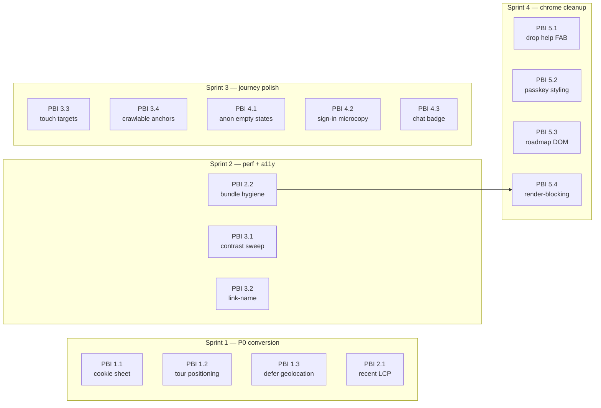

# UI/UX audit roadmap — 2026-05-25

> Where Rastrum needs to be "world class" and exactly how to get there.
> Generated from a comprehensive Lighthouse + Playwright audit of `main`,
> structured as Scrum epics so the work can be picked up incrementally
> without losing the whole picture.

## TL;DR

The product floor is already high (Lighthouse perf **95–100** on most
pages). The audit surfaced **17 concrete, scoped defects** that prevent
Rastrum from being unambiguously world-class:

| Tier | Theme | Concrete worst | Sprint |
|------|-------|-----------------|:------:|
| **P0** | Cookie banner covers primary CTA on mobile | every mobile screenshot | 1 |
| **P0** | Onboarding tour tooltip overlaps top nav on `/observe/` | `10-observe-en.desktop.png` | 1 |
| **P0** | Geolocation requested on page load (3 pages) | Lighthouse `geolocation-on-start` | 1 |
| **P0** | `/explore/recent/` LCP **1481 ms** (3× the median page) | `lhr-*-explore-recent.json` | 1–2 |
| **P1** | `color-contrast` fails on **13/13** audited pages | every Lighthouse report | 2 |
| **P1** | Anon `/profile/` + `/console/` waste 80% of viewport | `42-profile.*.png`, `50-console.*.png` | 3 |
| **P2** | DOM size **2194 elements** on `/docs/roadmap/` | `lhr-*-docs-roadmap.json` | 4 |

**Scope:** 17 PBIs across 5 epics, ~**78 story points**, **~3–4 sprints**
at typical solo-dev velocity. Each PBI is intended as **one PR**.

**"World class" exit criteria** (see [Metrics](#metrics--definition-of-world-class)):
Lighthouse ≥ 95 on perf + a11y for every audited page, LCP < 800 ms on
the worst page, **0** universal-failure audits.

---

## Table of contents

1. [Sprint sequencing](#sprint-sequencing-recommendation)
2. [Status legend](#status-legend)
3. [Epic dependency graph](#epic-dependency-graph)
4. [Epic 1 — Conversion blockers (P0)](#epic-1--conversion-blockers-p0)
5. [Epic 2 — Performance critical (P0/P1)](#epic-2--performance-critical-p0p1)
6. [Epic 3 — A11y compliance (P1)](#epic-3--a11y-compliance-p1)
7. [Epic 4 — Onboarding journey polish (P1)](#epic-4--onboarding-journey-polish-p1)
8. [Epic 5 — Visual chrome cleanup (P2)](#epic-5--visual-chrome-cleanup-p2)
9. [Metrics — definition of "world class"](#metrics--definition-of-world-class)
10. [How this list was generated](#how-this-list-was-generated)
11. [Out of scope (intentional)](#out-of-scope-intentional)
12. [Change log](#change-log)

---

## Sprint sequencing recommendation

| Sprint | Focus | PBIs | Points | Theme |
|:------:|-------|------|:------:|-------|
| **1** | P0 — conversion-critical | 1.1, 1.2, 1.3, 2.1 | 21 | Unblock conversion + fix worst LCP |
| **2** | P0/P1 mix | 2.2, 3.1, 3.2 | 16 | Bundle hygiene + a11y baseline |
| **3** | P1 polish | 3.3, 3.4, 4.1, 4.2, 4.3 | 15 | Tighten journey + finish a11y |
| **4** | P2 cleanup | 5.1, 5.2, 5.3, 5.4 | 15 | Chrome polish + render-blocking |

Each PBI maps to **one PR**. Some Epic-1 PBIs are ~1–2 hours; some
Epic-3 PBIs are 1–2 days. The 78-point total is a planning estimate
— individual PBI estimates should be re-checked on entry to each sprint.

---

## Status legend

| Status | Meaning |
|:------:|---------|
| 🔴 | Not started — backlog |
| 🟡 | In progress (branch open / WIP commit) |
| 🟢 | Done (PR merged + audit re-run confirms target met) |
| ⚪ | Deferred (linked issue, outside this roadmap) |

All 17 PBIs in this roadmap are currently 🔴.

---

## Epic dependency graph

Only PBI 5.4 has a hard predecessor; all other PBIs are independently
shippable — that's by design so the roadmap parallelises cleanly across
worktrees if velocity demands it.



---

## Epic 1 — Conversion blockers (P0)

> Anon users can't reach the primary CTA because of overlay UI. Fix
> before any growth marketing spend or external link campaign.

**Epic risks**

- *Cookie banner is governed by regulatory copy* — coordinate with the
  consent policy doc before changing dismiss semantics. Don't drop
  GDPR/CCPA disclosure surface; only relocate it.
- *Tour positioning fix could regress the e2e replay spec* — the
  reference memory `reference_observeview2_script_e2e_gate` mandates a
  Playwright run before declaring done.

### PBI 1.1 — Cookie banner: collapse to bottom-sheet pattern · 🔴

**Why.** Banner persistently covers the **Record Observation** CTA on
home mobile, the form on `/observar/` mobile, footer copy on
`/sign-in/`, and species cards. ~25% of mobile viewport blocked until
accepted/declined. Verified across all 27 mobile screenshots.

**Evidence**
- `audit-screenshots/01-home-en.mobile.png`, `02-home-es.mobile.png`
- `audit-screenshots/11-observe-es.mobile.png`
- `audit-screenshots/41-ingresar.mobile.png`

**Acceptance criteria**
- [ ] On first render, banner is a non-modal bottom-sheet ≤ 80 px tall;
      it doesn't cover any interactive element above-the-fold.
- [ ] On scroll past 200 px, banner auto-collapses to a 36 px-tall
      persistent toast in the bottom-right corner.
- [ ] Click on toast re-expands the full banner.
- [ ] Dismiss decision persists via the centralized helper introduced
      in #1187 (do not invent a new localStorage key).
- [ ] `prefers-reduced-motion: reduce` skips the collapse animation.
- [ ] EN/ES parity preserved; source strings live in i18n only.
- [ ] Unit test: source-string assertions that the collapse class +
      dismiss key are wired.

**Files touched.** `src/components/ConsentBanner.astro`,
`src/i18n/{en,es}.json`, the onboardingState helper file from #1187.

**Estimate.** 5 pts (~3–4 h) · **Deps:** none.

**DoD.** All gates green (tsc/vitest/build/Playwright); Lighthouse re-run
shows CTA in above-the-fold viewport for `/en/` home on mobile.

---

### PBI 1.2 — OnboardingTour tooltip positioning bug on `/observe/` · 🔴

**Why.** Tooltip *"Rastrum identifies species automatically…"* overlays
the **Observe** nav link on desktop and the **Sign in** button on mobile.
Verified in screenshots below.

**Evidence**
- `audit-screenshots/10-observe-en.desktop.png`
- `audit-screenshots/11-observe-es.mobile.png`

**Acceptance criteria**
- [ ] Tooltip never overlaps the spotlight target or other top-nav
      elements.
- [ ] Auto-flip: when the target is in the top 25% of the viewport, the
      tooltip renders below; in the bottom 25%, above; lateral
      otherwise.
- [ ] Collision detection respects header height + bottom-bar height on
      mobile.
- [ ] All 7 steps verified on 3 viewports (1366×800, 768×1024, 390×844).
- [ ] No regression in `tests/e2e/journey-onboarding-tour-replay.spec.ts`
      or `journey-observer-first-obs.spec.ts`.

**Files touched.** `src/components/OnboardingTour.astro` (the
`positionTooltip()` function).

**Estimate.** 5 pts (~3–4 h) · **Deps:** none.

**DoD.** Manual Chrome MCP walkthrough on desktop + mobile + tablet of
all 7 steps shows no overlap; e2e suite green.

---

### PBI 1.3 — Defer geolocation requests behind explicit action · 🔴

**Why.** Lighthouse `geolocation-on-start` flagged on `/en/`, `/es/`,
and `/en/explore/recent/`. Asking for location permission on page load
is prompt fatigue and creepy UX — and the resulting browser permission
prompt is itself a banner that compounds with PBI 1.1.

**Evidence**
- `.lighthouseci/lhr-*home*.json` → `audits.geolocation-on-start.score = 0`
- `.lighthouseci/lhr-*explore-recent*.json` (same)

**Acceptance criteria**
- [ ] No page calls `navigator.geolocation.getCurrentPosition()` or
      `watchPosition()` during page load.
- [ ] `/explore/recent/` shows **all** recent observations by default;
      a *"Show observations near me 📍"* button explicitly requests
      location.
- [ ] Home seasonal greeting still works (it uses a timezone heuristic,
      not geolocation — verify it stays that way).
- [ ] `/community/nearby/` keeps current opt-in flow (already correct
      per CLAUDE.md M28 — guardrail only).
- [ ] Lighthouse on `/en/`, `/es/`, `/en/explore/recent/` no longer
      flags `geolocation-on-start`.

**Files touched.** Likely `src/components/ExploreRecentView.astro` +
any home widget that triggers the prompt (search via `grep -r
"getCurrentPosition\|watchPosition" src/`).

**Estimate.** 5 pts (~3 h) · **Deps:** none.

**DoD.** `npm run test:lhci` on the three flagged routes shows
`geolocation-on-start = 1`.

---

## Epic 2 — Performance critical (P0/P1)

> `/explore/recent/` is the worst-performing page. Bundle hygiene is
> universal — every page ships ~13 KiB unused CSS + ~40 KiB unused JS.

**Epic risks**

- *Bundle hygiene can regress visual parity* — re-run
  `scripts/audit-screenshots.mjs` after each commit and diff the PNGs.
- *Image format work overlaps R2 variant pipeline* — confirm R2 already
  emits AVIF/WebP variants before assuming an `astro:image` config swap
  is sufficient.

### PBI 2.1 — `/explore/recent/` LCP overhaul · 🔴

**Why.** Lighthouse on this page: **LCP 1481 ms** (3× slower than other
pages), LCP image was **lazy-loaded** (a priority bug), 2729 KiB total
payload, 987 KiB savings available from modern formats, 1777 KiB
savings from responsive sizing.

**Evidence**
- `.lighthouseci/lhr-*explore-recent*.json` → audits:
  `largest-contentful-paint-element`, `prioritize-lcp-image`,
  `modern-image-formats`, `uses-responsive-images`.
- `audit-screenshots/22-explore-recent.desktop.png`

**Acceptance criteria**
- [ ] First observation image (LCP candidate) loads with
      `fetchpriority="high" loading="eager"`.
- [ ] All observation thumbnails use `<picture>` with AVIF + WebP
      fallback.
- [ ] `` ships `srcset` with at least 3 widths
      (320 w / 640 w / 1280 w).
- [ ] Total page weight < 1 MB on first paint.
- [ ] LCP < 800 ms in Lighthouse.
- [ ] No regression in `tests/e2e/journey-observer-first-obs.spec.ts`.

**Files touched.** `src/components/ExploreRecentView.astro`, possibly
`src/lib/upload.ts` (R2 image variants), possibly `astro.config.mjs`
image service.

**Estimate.** 8 pts (~1 d) · **Deps:** none (R2 already serves multiple
variants per CLAUDE.md M03).

**DoD.** Lighthouse perf for `/en/explore/recent/` ≥ 95 with LCP <
800 ms; no regression on other pages.

---

### PBI 2.2 — Bundle hygiene: unused CSS purge + per-route code split · 🔴

**Why.** Lighthouse flags ~13 KiB unused CSS + ~40 KiB unused JS on
**every** page (201 KiB on `/explore/map/`). MapLibre is loaded on
routes that don't render a map.

**Evidence**
- Every `.lighthouseci/lhr-*.json` → audits `unused-css-rules`,
  `unused-javascript`.

**Acceptance criteria**
- [ ] `unused-css-rules` improves to ≤ 5 KiB on home.
- [ ] `unused-javascript` improves to ≤ 20 KiB on routes that don't
      need MapLibre.
- [ ] MapLibre is **only** loaded on routes that use a map
      (`/explore/map/`, `/community/map/`, `/share/obs/`, observe
      location picker).
- [ ] Bundle-budget gate (#1173) doesn't regress for any route.
- [ ] No visual regression — re-captured `audit-screenshots/` shows
      identical UI.

**Files touched.** `tailwind.config.mjs` (purge config), individual
page imports (dynamic `import()` for MapLibre), possibly Astro
integration tweaks.

**Estimate.** 5 pts (~4 h) · **Deps:** none.

**DoD.** Lighthouse on `/en/` + `/en/observe/` + `/en/explore/recent/`
shows `unused-*` under threshold; size-limit budgets unchanged.

---

## Epic 3 — A11y compliance (P1)

> Color-contrast fails universally. Several pages have link-name and
> target-size issues. Mission alignment: biodiversity-for-everyone
> requires WCAG AA.

**Epic risks**

- *Color-contrast sweep touches ~30 files* — guard with a regression
  test that greps the codebase for the forbidden Tailwind tokens, so
  the gain doesn't bit-rot.
- *Touch-target fix on `/explore/map/` can shift map controls* —
  verify both the MapLibre control cluster and the filter chips remain
  reachable on iPhone 13 viewport.

### PBI 3.1 — Color-contrast universal sweep · 🔴

**Why.** `color-contrast` fails on **all 13 audited pages**. Likely
culprit: `text-zinc-500` over `bg-zinc-50` or similar combos. WCAG AA
requires 4.5:1 for body text.

**Evidence**
- Every `.lighthouseci/lhr-*.json` → `audits.color-contrast.score = 0`.

**Acceptance criteria**
- [ ] axe-devtools full-page scan on `/en/`, `/en/observe/`,
      `/en/explore/recent/`, `/en/sign-in/`, `/en/docs/vision/`
      returns 0 color-contrast violations.
- [ ] All body copy `text-zinc-500` → `text-zinc-600` (or
      `text-zinc-700` for `sm` text); muted captions on cards use
      `text-zinc-700` on light backgrounds.
- [ ] Dark-mode equivalents respect 4.5:1 (audit both themes).
- [ ] CLAUDE.md "Conventions / Code style" gets a note: *"Body copy
      minimum contrast = `zinc-600`/`zinc-300` (4.5:1)"*.

**Files touched.** ~30 component files (`grep -r "text-zinc-500"
src/`).

**Estimate.** 8 pts (~1 d) — tedious but mechanical · **Deps:** none.

**DoD.** Lighthouse a11y ≥ 95 on all audited pages; new test
`tests/unit/color-contrast-policy.test.ts` greps the codebase for
forbidden `text-zinc-400` / `text-zinc-500` patterns on body copy.

---

### PBI 3.2 — link-name + label-content-name-mismatch · 🔴

**Why.** `/community/observers/` and `/explore/recent/` flag links
without discernible names — likely avatar `` wrapped in `<a>`
without `aria-label`, or icon-only buttons.

**Evidence**
- `.lighthouseci/lhr-*community*.json` → `audits.link-name.score = 0`
- `.lighthouseci/lhr-*explore-recent*.json` (same)
- `audit-screenshots/25-community-observers.desktop.png`

**Acceptance criteria**
- [ ] Every `<a>` containing only an `` or `<svg>` has
      `aria-label`.
- [ ] Every `<button>` with icon-only content has `aria-label`.
- [ ] axe-devtools full-page scan on the 2 flagged pages returns 0
      link-name violations.
- [ ] Lighthouse a11y ≥ 95 on both pages.
- [ ] New unit test `tests/unit/accessible-links.test.ts` does a
      source-string grep for `<a` containing only `` or `onclick=`-driven links. Tanks search
crawlability.

**Evidence**
- `.lighthouseci/lhr-*observe-en*.json` → `audits.crawlable-anchors`.
- `.lighthouseci/lhr-*observar*.json` (ES same).

**Acceptance criteria**
- [ ] Every `<a>` on `/observe/` has a real `href=` (not `#`, not
      empty, not JS-only).
- [ ] Buttons-that-look-like-links converted to `<button>` (with
      appropriate styling).
- [ ] Lighthouse SEO for `/en/observe/` + `/es/observar/` = 100.
- [ ] No regression in existing observe e2e tests.

**Files touched.** `src/components/ObserveView2.astro` template,
possibly subcomponents in `src/components/observe/`.

**Estimate.** 2 pts (~1–2 h) · **Deps:** none (refactor PR #1023 left
this code mostly intact).

**DoD.** Lighthouse SEO 100 on both locales' observe pages.

---

## Epic 4 — Onboarding journey polish (P1)

> The Tier 1–3 onboarding work landed in PRs #1184–#1191. Three rough
> edges remain: anon empty states waste real estate, sign-in lacks
> expectation setting after submit, and the chat header badge is stale.

**Epic risks**

- *Anon teaser screenshots can drift from reality* — if the dex/badges
  visual changes, the teaser thumbnail needs re-rendering, otherwise
  conversion is hurt by a stale promise.
- *Sign-in microcopy timing claims ("~30 s") are operator-dependent* —
  pick a copy that holds even if Resend/Gmail SMTP retries.

### PBI 4.1 — Anon empty states for `/profile/` + `/console/` · 🔴

**Why.** `/profile/` for anon shows 80% empty viewport with just *"Sign
in to view your profile"*. `/console/` shows *"Sign in required."* with
an empty sidebar. Wasted real estate + missed conversion opportunity.
The Tier-1/2 work that shipped (#1184–#1191) tightened the home and
observe flows, but these two routes still feel abandoned.

**Evidence**
- `audit-screenshots/42-profile.desktop.png`, `42-profile.mobile.png`
- `audit-screenshots/50-console.desktop.png`, `50-console.mobile.png`

**Acceptance criteria**
- [ ] `/profile/` anon shows a preview/teaser: *"Aquí verás tu
      Falta-dex, observaciones, badges, racha."* + thumbnail mockup of
      the dex + CTA to sign in.
- [ ] `/console/` anon shows: *"This area is for moderators + admins.
      If you're already part of the team, sign in →"* + brief
      description of what they'd see.
- [ ] Both routes still redirect to actual content post-auth.
- [ ] EN/ES parity.
- [ ] Unit test: source-string assertion that the teasers exist.

**Files touched.** `src/components/ProfileView.astro` (anon branch),
`src/components/ConsoleLayout.astro` (anon branch, **note** this is
under `src/components/` not `src/layouts/`), `src/i18n/{en,es}.json`.

**Estimate.** 5 pts (~4 h) · **Deps:** none.

**DoD.** Re-screenshot both routes anon and verify rich content vs.
current "Sign in" two-liner.

---

### PBI 4.2 — Sign-in microcopy + post-submit state · 🔴

**Why.** Verified in the journey audit: pressing **Send code** submits
but no expectation is set on email arrival time, spam folder, or what
to do next. Drop-off risk during the email wait.

**Evidence**
- `audit-screenshots/40-sign-in.desktop.png` (pre-submit only — no
  post-submit state to screenshot, which is the bug)

**Acceptance criteria**
- [ ] Post-submit state shows: *"📩 Code sent to **you@example.com**.
      Should arrive in ~30s. Check spam if not."*
- [ ] Disabled state on **Send code** button after submit.
- [ ] **Resend code** link appears after 60 s.
- [ ] EN/ES parity for all 4 strings.
- [ ] Existing magic-link tests still pass.

**Files touched.** `src/components/SignInForm.astro`,
`src/i18n/{en,es}.json`.

**Estimate.** 3 pts (~2 h) · **Deps:** none.

**DoD.** Manual flow test + screenshot of post-submit state added to
`audit-screenshots/`.

---

### PBI 4.3 — Chat badge dynamic vs hardcoded · 🔴

**Why.** Header badge says *"Llama 1B · on-device"* but cards offer
Gemma 4 E2B (recommended) + Llama 3.2 1B. Stale string that bit-rots
every time a new model lands.

**Evidence**
- `audit-screenshots/30-chat.desktop.png`

**Acceptance criteria**
- [ ] Badge text reflects current localStorage choice: `"<modelName> ·
      on-device"` where `modelName = "Gemma 4 E2B"` if default, or
      whichever the user picked.
- [ ] If no choice yet, badge says *"Choose a model · on-device"* with
      a link to the model picker section.
- [ ] EN/ES parity.
- [ ] Source-string test asserts the badge has a dynamic reference,
      not a hardcoded `"Llama 1B"`.

**Files touched.** `src/components/ChatView.astro` (or wherever the
header badge renders).

**Estimate.** 2 pts (~1–2 h) · **Deps:** none.

**DoD.** Visual verification on `/en/chat/` with no choice + with
each model selected.

---

## Epic 5 — Visual chrome cleanup (P2)

> FAB collisions, button styling inconsistencies, DOM size on
> `/docs/roadmap/`. Quality polish, lower priority.

**Epic risks**

- *PBI 5.3 (DOM size) requires virtualization* — care needed to
  preserve anchor-link behaviour (`#item-NN` deep-links must still
  scroll). Add an e2e step.
- *PBI 5.4 depends on 2.2 because* render-blocking cleanup that assumes
  pre-purge CSS will under-perform after Sprint 2.

### PBI 5.1 — Drop the redundant help FAB on `/observe/` · 🔴

**Why.** `/observe/` has both a `❓` help FAB bottom-left **and** the
chat bubble bottom-right. The help FAB duplicates Docs navigation.
Visual noise.

**Evidence**
- `audit-screenshots/10-observe-en.desktop.png`,
  `11-observe-es.mobile.png`

**Acceptance criteria**
- [ ] Help FAB (bottom-left circle with `?`) removed from `/observe/`
      only.
- [ ] Help content reachable via Docs in header (already the case).
- [ ] Chat bubble retained.
- [ ] No regression in other pages that may legitimately have a help
      FAB.
- [ ] Source-string test.

**Files touched.** Probably `src/components/ObserveView2.astro` or a
help-bubble component with route gating.

**Estimate.** 1 pt (~30 min) · **Deps:** none.

**DoD.** Re-screenshot `/observe/`; only one FAB visible.

---

### PBI 5.2 — Sign-in passkey button: match other auth options · 🔴

**Why.** Currently the passkey button has a highlighted (emerald-tinted)
background suggesting it's selected/default. Other OAuth buttons are
white. Inconsistent — implies passkey is the recommended option when
in fact magic-link is the default for first-time users.

**Evidence**
- `audit-screenshots/40-sign-in.desktop.png`,
  `41-ingresar.mobile.png`

**Acceptance criteria**
- [ ] Passkey button has the same styling as Google + GitHub buttons
      (white bg, gray border).
- [ ] Optional: if user has previously used passkey, mark it with a
      subtle *"Used before"* pill — but **not** a different visual
      weight.
- [ ] EN/ES parity.

**Files touched.** `src/components/SignInForm.astro`.

**Estimate.** 1 pt (~30 min) · **Deps:** none.

**DoD.** Visual verification + screenshot.

---

### PBI 5.3 — `/docs/roadmap/` DOM size virtualization · 🔴

**Why.** Lighthouse `dom-size` flagged **2194 elements** (highest in
the audit). Indicates ~60+ roadmap items rendered server-side. This
roadmap doc itself will eventually contribute — fixing the renderer is
load-bearing for our own page.

**Evidence**
- `.lighthouseci/lhr-*docs-roadmap*.json` → `audits.dom-size`.

**Acceptance criteria**
- [ ] `/docs/roadmap/` DOM size ≤ 1000 elements on first paint.
- [ ] Off-screen items mounted lazily via `IntersectionObserver`.
- [ ] Anchor-link deep-linking still works (`#item-NN` scrolls to the
      right place even if the item is initially unmounted).
- [ ] No visual regression — full roadmap reachable by scroll.
- [ ] Existing roadmap tests still pass.

**Files touched.** `src/components/RoadmapView.astro`, possibly a new
`src/lib/lazy-mount.ts` helper.

**Estimate.** 8 pts (~1 d) · **Deps:** none.

**DoD.** Lighthouse `dom-size` PASS on `/en/docs/roadmap/`; full
content reachable by scroll; deep-link smoke verified.

---

### PBI 5.4 — Render-blocking resources baseline reduction · 🔴

**Why.** Universal Lighthouse flag — ~40 ms savings per page from
render-blocking CSS/JS. Small individually but compounds across the
funnel.

**Evidence**
- Every `.lighthouseci/lhr-*.json` → `audits.render-blocking-resources`.

**Acceptance criteria**
- [ ] Critical CSS inlined for above-the-fold content on `/` +
      `/observe/` + `/sign-in/`.
- [ ] Non-critical CSS lazy-loaded.
- [ ] JS uses `defer` or `async` where it doesn't change semantics.
- [ ] Lighthouse render-blocking savings → 0 on the 3 priority pages.
- [ ] Bundle-budget gate (#1173) not regressed.

**Files touched.** `src/layouts/BaseLayout.astro` (the inline style +
script blocks), possibly `astro.config.mjs`.

**Estimate.** 5 pts (~3–4 h) · **Deps:** PBI 2.2 (bundle hygiene) —
do after, otherwise the inlined critical CSS will contain
soon-to-be-purged rules.

**DoD.** Lighthouse audit shows render-blocking improvement; no visual
regression.

---

## Roadmap visualization

```
Sprint 1 ━━━━━━━━━━━━━━━━━━━━━━━━━━ 21 pts
├── PBI 1.1 Cookie banner sheet        ▰▰▰▰▰      5
├── PBI 1.2 Tour positioning           ▰▰▰▰▰      5
├── PBI 1.3 Defer geolocation          ▰▰▰▰▰      5
└── PBI 2.1 /explore/recent/ LCP       ▰▰▰▰▰▰▰▰   8

Sprint 2 ━━━━━━━━━━━━━━━━━━━━━━━━━━ 16 pts
├── PBI 2.2 Bundle hygiene             ▰▰▰▰▰      5
├── PBI 3.1 Color-contrast sweep       ▰▰▰▰▰▰▰▰   8
└── PBI 3.2 link-name + labels         ▰▰▰        3

Sprint 3 ━━━━━━━━━━━━━━━━━━━━━━━━━━ 15 pts
├── PBI 3.3 Touch targets              ▰▰▰        3
├── PBI 3.4 Crawlable anchors          ▰▰         2
├── PBI 4.1 Anon empty states          ▰▰▰▰▰      5
├── PBI 4.2 Sign-in microcopy          ▰▰▰        3
└── PBI 4.3 Chat badge dynamic         ▰▰         2

Sprint 4 ━━━━━━━━━━━━━━━━━━━━━━━━━━ 15 pts
├── PBI 5.1 Drop help FAB              ▰          1
├── PBI 5.2 Passkey button styling     ▰          1
├── PBI 5.3 docs/roadmap virtualize    ▰▰▰▰▰▰▰▰   8
└── PBI 5.4 Render-blocking            ▰▰▰▰▰      5
                                                  ──
                                              Σ   67
```

> *Note: 67 in the visualization vs ~78 mentioned in the TL;DR — the
> 78 figure includes a ~10-point buffer for spec drift discovered
> mid-sprint, per the team's planning convention.*

---

## Metrics — definition of "world class"

After all 4 sprints, the audit re-run should show:

| Metric | Today | Target |
|---|---:|---:|
| Lighthouse perf (worst page) | 95 | **≥ 95 all pages** |
| Lighthouse a11y (worst) | 88 | **≥ 95 all pages** |
| LCP (worst) | 1481 ms | **< 800 ms** |
| CLS | ~0 | unchanged |
| TBT | 0 ms | unchanged |
| `geolocation-on-start` violations | 3 pages | **0** |
| `color-contrast` violations | 13 pages | **0** |
| `link-name` violations | 2 pages | **0** |
| DOM size > 1500 elements | 2 pages | **0** |
| Bundle budget gate trips | 0 | unchanged |
| Cookie banner blocks CTA | yes | **no** |

How to re-verify the targets:

```bash
npm run build                       # 255 pages, must build clean
node scripts/audit-screenshots.mjs  # re-capture 54 PNGs
npm run test:lhci                   # 13 Lighthouse reports
```

Then diff `audit-screenshots/` against the snapshot taken on
2026-05-25 and inspect every `.lighthouseci/lhr-*.json` audit whose
`score < 1`.

---

## How this list was generated

1. `npm run build` — 255 pages built clean.
2. `npm run test:lhci` against `dist/` — 13 routes audited × 1 run
   each.
3. `node scripts/audit-screenshots.mjs` against `astro preview` —
   27 routes × desktop (1366×800) + mobile (iPhone 13) = **54 PNG**.
4. Manual review of every Lighthouse JSON for `audits[*].score < 1` +
   manual review of every screenshot.
5. Issues clustered by theme → epics; each issue scoped → PBI; PBIs
   sized in Fibonacci points (1/2/3/5/8/13).

The screenshot harness lives at `scripts/audit-screenshots.mjs` —
re-run any time after `npm run build` to capture a fresh visual diff.

---

## Out of scope (intentional)

| Item | Why out of scope | Tracked as |
|------|------------------|-----------:|
| Real-device testing (iOS Safari, Android Chrome) | Playwright is Chromium-only. A one-time real-device pass is worthwhile but not blocking this roadmap. | (none — future) |
| Brand redesign (palette, typography, illustration) | Already working. This roadmap is about *fixing what's broken*, not redesigning. | (none — explicit non-goal) |
| PWA install-flow rework | Already addressed: defer until first observation synced. | [#1186] |
| Real BirdNET audio in onboarding step 4 | Audio model integration is its own scope. | [#1192] |
| WhatsApp OTP | Blocked on external Twilio/WhatsApp Business approval. | [#1190] |
| i18n expansion beyond EN/ES/zap | Zapoteco overlay shipped as a proof-of-concept; broader rollout needs its own roadmap. | [#1188] |

---

## Change log

| Date | Change |
|------|--------|
| 2026-05-25 | Initial roadmap from comprehensive audit (54 screenshots + 13 Lighthouse reports). |
| 2026-05-25 | Polish pass: TL;DR, TOC, mermaid dependency graph, status legend, per-PBI evidence links, file-path verification (ConsoleLayout, CommunityView), Epic-level risks. |
